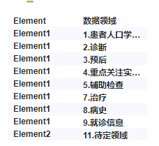
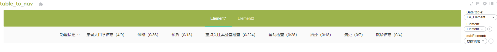
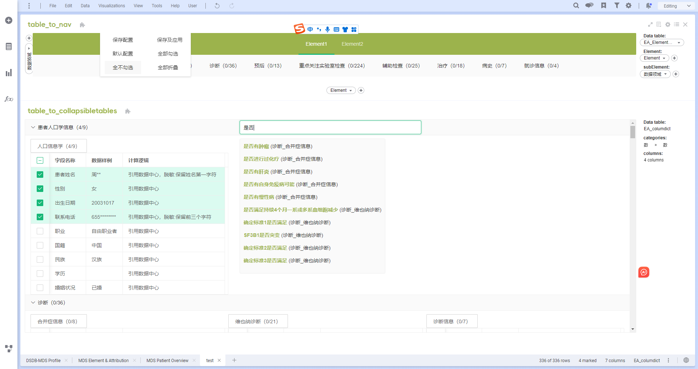

# Mod Starter Project
This is a mod template project. It contains the minimum amount of code necessary to run a working mod.  

All source code for the mod example can be found in the `src` folder.

## Prerequisites
These instructions assume that you have [Node.js](https://nodejs.org/en/) (which includes npm) installed.

## How to get started (with development server)
- Open a terminal at the location of this example.
- Run `npm install`. This will install necessary tools. Run this command only the first time you are building the mod and skip this step for any subsequent builds.
- Run `npm run server`. This will start a development server.
- Start editing, for example `src/main.js`.
- In Spotfire, follow the steps of creating a new mod and connecting to the development server.

## Working without a development server
- In Spotfire, follow the steps of creating a new mod and then browse for, and point to, the _manifest_ in the `src` folder.
## 功能描述
将table转为导航栏
例如原表图1，特征有，字段Element大分类字段，数据领域小分类字段，通过此mod会转为大分类字段作为导航栏的上层数据，小分类数据作为对应的下层数据，结果如图2

通常与项目 spotfire-mod-table_to_collapsibletables结合起来用，这样导航栏就能与字表联动了，效果如图3
